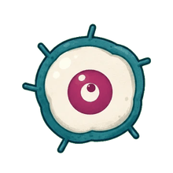

<p align="center">
  <picture>
    <source media="(prefers-color-scheme: dark)" srcset="assets/mote/mote-dark.gif">
    
  </picture>
</p>

<h1 align="center">SoulStack</h1>

<p align="center">
  <b>ProxySoul × Empryo</b><br>
  The skills, presets, prompts and habits behind Empryo, ready for your own agent.
</p>

<p align="center">
  <a href="https://soulstack.proxysoul.com"><b>Website</b></a>&nbsp;&nbsp;&nbsp;
  <a href="https://soulstack.proxysoul.com/docs">Docs</a>&nbsp;&nbsp;&nbsp;
  <a href="https://soulstack.proxysoul.com/immunity/">Immunity</a>&nbsp;&nbsp;&nbsp;
  <a href="#set-it-up">Set it up</a>&nbsp;&nbsp;&nbsp;
  <a href="#whats-inside">What's inside</a>&nbsp;&nbsp;&nbsp;
  <a href="#my-empryo-setup">My Empryo setup</a>&nbsp;&nbsp;&nbsp;
  <a href="LICENSE">MIT</a>
</p>

<br>

## Set it up

Point your agent at this repo and let it do the work. In Empryo, or any agent that can run commands:

```text
Set up SoulStack for me from https://github.com/proxysoul/SoulStack and follow its AGENTS.md.
```

Or pick just the skills you want, for any agent, with the [skills](https://skills.sh) CLI:

```bash
npx skills add proxysoul/SoulStack
```

It lists the skills, asks which to install and for which agents. For Empryo, choose **Universal** (it installs into `.agents/skills`, which Empryo reads). Add `-g` for every project, `-s ensoul` to skip the picker, `--list` to only look.

Using GitHub Copilot CLI? SoulStack is also a Copilot plugin, with the skills and the takeaways as rules:

```bash
copilot plugin marketplace add proxysoul/SoulStack
copilot plugin install soulstack@soulstack
```

Or everything, with the setup script. It asks nothing and changes nothing without a backup:

- downloads SoulStack to `~/dev/SoulStack` (or updates it)
- links the skills into `~/.agents/skills`, and `~/.claude/skills` if you use Claude Code
- links the ten immune cells into Empryo, Claude Code, Copilot CLI and OpenCode
- adds the [takeaways](guides/takeaways.md) to the global rules of every agent it finds: `~/.empryo/EMPRYO.md`, `~/.claude/CLAUDE.md`, `~/.codex/AGENTS.md`, `~/.copilot/copilot-instructions.md`, `~/.pi/agent/AGENTS.md`, `~/.config/opencode/AGENTS.md`. Your own rules stay; SoulStack's part sits in a marked block that updates in place
- skips anything Empryo-only when Empryo isn't installed

<table>
  <tr><td><b>macOS, Linux</b></td><td>

```bash
curl -fsSL https://raw.githubusercontent.com/proxysoul/SoulStack/main/scripts/setup.sh | sh
```

  </td></tr>
  <tr><td><b>Windows</b></td><td>

```powershell
irm https://raw.githubusercontent.com/proxysoul/SoulStack/main/scripts/setup.ps1 | iex
```

  </td></tr>
</table>

Every file it changes is copied to `<file>.bak-<time>` first.

### Staying up to date

Setup also adds a `soulstack` command (in `~/.local/bin` on macOS and Linux, in your user apps folder on Windows):

```bash
soulstack check     # is a new version out? changes nothing
soulstack update    # get it, set everything up again, show what changed
soulstack remove    # take SoulStack out; your own rules stay
```

`update` pulls the latest SoulStack, refreshes the skills and the rules block in every agent, and lists what's new. If you changed files in your copy, it keeps them and tells you instead of overwriting. Without the command, running the one-liner again does the same. Copilot plugin users run `copilot plugin update soulstack`.

From a clone you can also pass:

| macOS, Linux | Windows | Does |
| --- | --- | --- |
| `--presets proxysoul,proxysoul-mcp` | `-Presets proxysoul,proxysoul-mcp` | Also add my Empryo presets (optional) |
| `--check` | `-Check` | Change nothing, show what is installed |
| `--remove` | `-Remove` | Take SoulStack out again; your own rules stay |
| `--skills <folder>` | `-Skills <folder>` | Link the skills somewhere else |
| `--plain` | `-Plain` | No colour or animation (automatic for agents and pipes) |

<br>

## Best with Empryo

SoulStack comes from the team that builds [Empryo](https://empryo.com). It works in Claude Code, Codex, Copilot CLI, pi and OpenCode, and goes further in Empryo:

| In Empryo | What it changes |
|---|---|
| Rules reload live | Edits and `soulstack update` apply on the next message, no restart |
| The Genome | Immune cells ask the code map where a bug lands before they attack or judge it |
| `project` tool | Checks run the same way for every agent: `immune`, `immune:smoke` |
| Background agents | `tcell-helper` runs the other cells in parallel |
| Memory | Confirmed bugs, disproved claims and traps carry over to the next run |
| Browser and computer use | Cells drive web and desktop apps through their real front doors |
| Routines | A nightly `/routine` patrols and wakes the lead on red |
| `EMPRYO.md` template | Empryo fills it in from the Genome, writing only what the code can't show |

## What's inside

<table>
  <tr>
    <td width="50%" valign="top">
      <h3><a href="skills/ensoul/SKILL.md">ensoul</a></h3>
      A skill that builds a product's design system and redesigns its website: reads the code and your vibe, connects every theme to its logos and screenshots, keeps one spacing scale, and proves it with screenshots.
    </td>
    <td width="50%" valign="top">
      <h3><a href="templates/EMPRYO.md">EMPRYO.md template</a></h3>
      A rules file that fills itself in. Copy it into a project and Empryo studies the project, then writes down only what its code map can't: rules, traps, commands and how you work.
    </td>
  </tr>
  <tr>
    <td valign="top">
      <h3><a href="guides/takeaways.md">Takeaways</a></h3>
      Rules every agent here follows: finish the job, reproduce before fixing, prove it before and after, report with visuals, use memory.
    </td>
    <td valign="top">
      <h3><a href="guides/agent-guidance.md">Working habits</a></h3>
      How Empryo's own agent works: map first, read before editing, check after every change, answer short.
    </td>
  </tr>
  <tr>
    <td valign="top">
      <h3><a href="skills/immune-system/SKILL.md">immune-system</a></h3>
      Testing that works like an immune system, grown for each project by your agent: it studies the product, researches this month's tools, drives the real app on every platform, and turns every confirmed bug into a permanent check. It ships a small web app (<code>immune:app</code>) in your project's design system to see health, runs, cells and findings, and to start runs.
    </td>
    <td valign="top">
      <h3><a href="agents/">Ten immune cells</a></h3>
      <code>tcell-helper</code> leads; <code>dendritic</code> finds what is missing, <code>tcell-hunter</code> attacks, <code>negative-selection</code> kills false alarms, <code>memory-cell</code> makes bugs permanent checks, <code>tcell-patrol</code> runs everything, <code>natural-killer</code> guards security (packages, secrets, installers), plus platform, visual and toolsmith cells. Installed as stem cells; each grows into your project's own version.
    </td>
  </tr>
  <tr>
    <td valign="top">
      <h3><a href="immune/">SoulStack's own immune system</a></h3>
      The worked example: setup and update tests on Linux and Windows, security checks, and the immune app. Run <code>bun run immune:app</code>, or see the snapshot on the website under <em>View SoulStack immunity</em>.
    </td>
    <td valign="top">
      <h3><a href="site/">Website and docs</a></h3>
      Every layer shown visually in Empryo's six worlds, with docs for people and <code>llms.txt</code> plus Markdown pages for agents. <code>bun run dev</code> starts it.
    </td>
  </tr>
  <tr>
    <td valign="top">
      <h3><a href="guides/mote-mascot.md">Mascot guide</a></h3>
      How to draw a calm mascot of your own: one fixed body, a moving eye, a green screen, every frame aligned. Shown with Mote, Empryo&#39;s mascot, which is not part of the stack.
      <br><br>
      
    </td>
    <td valign="top">
      <h3><a href="prompts/website-redesign.md">Prompts</a> and <a href="templates/">templates</a></h3>
      The redesign brief as one message for agents without skills, and starting points for a new skill, preset or prompt.
    </td>
  </tr>
</table>

<br>

## My Empryo setup

My global config as three presets in [`plugins/presets/`](plugins/presets/):

| Preset | Sets |
| --- | --- |
| `proxysoul` | GPT-6 Sol as the main model, Astra for reviews and second opinions, Luna for grunt work and subagents; Undertow-style theme, desktop appearance, editor, agent features |
| `proxysoul-trusted` | Full autonomy: yolo, auto-approve, every computer-use switch. Trusted machines only |
| `proxysoul-mcp` | MCP servers; tokens come from environment variables, never the file |

Add them with `scripts/setup.sh --presets proxysoul,proxysoul-mcp`, or for one launch with `empryo --plugin <path>`. After changing settings in Empryo, refresh them with `bun scripts/export-config.ts`: it drops machine-only state, moves risky switches into the trusted preset, and refuses to write anything that looks like a secret.

<br>

<p align="center">
  <sub>Made by <a href="https://github.com/proxysoul">ProxySoul</a> with <a href="https://empryo.com">Empryo</a>. Code and docs are MIT licensed. Mote and the Empryo name and logo are not: see <a href="LICENSE">LICENSE</a>.</sub>
</p>
